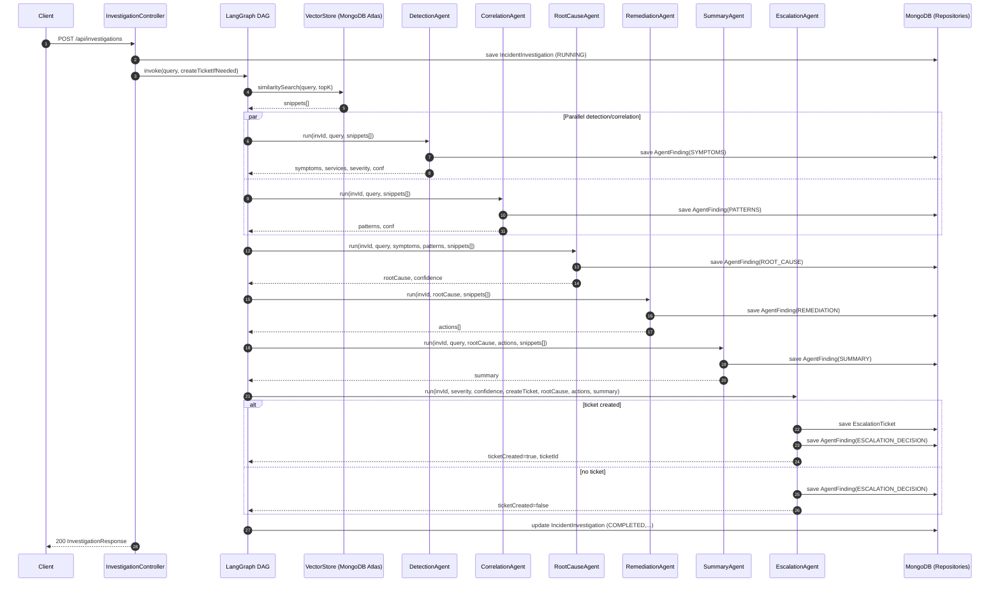
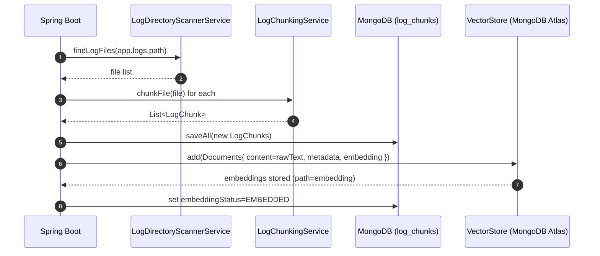

# AI Incident Investigation – Design and Dataflow

## 1. Overview
Backend-only, multi-agent incident investigation system that ingests local logs, builds OpenAI embeddings, stores vectors in MongoDB Atlas Vector Search, and orchestrates multiple Spring AI agents via a LangGraph4j DAG to detect symptoms, correlate failures, derive root cause, recommend remediation, summarize, and escalate when needed.

Goals
- Real LLM and embedding calls (no mock AI in runtime)
- Vector similarity search across logs with metadata
- True multi-agent architecture with independent prompts, calls, and persisted findings
- Deterministic, auditable orchestration
- No UI; REST APIs only

Non-Goals
- Streaming/Kafka/cloud ingestion
- Frontend or visualization layer
- Fake/dummy root-cause logic

## 2. Tech Stack
- Java 21, Spring Boot 4.x
- Spring Web MVC, Spring Data MongoDB
- Spring AI (OpenAI, MongoDB Atlas VectorStore)
- OpenAI models: gpt-4o (chat), text-embedding-3-small (embeddings)
- LangGraph4j for DAG orchestration

## 3. Configuration & Secrets
Environment variables
- OPENAI_API_KEY
- MONGODB_URI

Key properties (application.properties)
- spring.mongodb.uri=${MONGODB_URI}
- spring.ai.openai.chat.model=gpt-4o
- spring.ai.openai.embedding.model=text-embedding-3-small
- spring.ai.vectorstore.type=mongodb-atlas
- spring.ai.vectorstore.mongodb.atlas.collection-name=vector_store
- spring.ai.vectorstore.mongodb.atlas.vector-index-name=default
- spring.ai.vectorstore.mongodb.atlas.path-name=embedding
- app.logs.path=./sample-logs
- app.ingestion.enabled=true

Secrets are never hardcoded; they are injected via environment.

## 4. High-Level Architecture
Layers
- Controller: REST APIs for investigations, tickets, and semantic log search
- Orchestrator: LangGraph DAG creation/invocation + final aggregation
- Agents (AI Services): Detection, Correlation, Root Cause, Remediation, Summary, Escalation
- Vector: Spring AI VectorStore (MongoDB Atlas) + OpenAI embedding model
- Log Pipeline: directory scanner, chunker, embedder, and startup initializer
- Persistence: Spring Data MongoDB repositories for domain entities
- Exception Handling: Global @RestControllerAdvice

Separation of concerns
- Deterministic responsibilities: I/O, parsing, chunking, metadata extraction, embeddings invocation, vector storage, orchestration, persistence, thresholds
- AI responsibilities: semantic reasoning over unstructured logs, extracting findings, correlating across services, root cause analysis, remediation, and narrative summaries

## 5. Domain Model
- LogChunk: deterministic chunked log record; metadata mirrors vector document metadata
- AgentFinding: per-agent output, evidence, and confidence; persisted for auditability
- IncidentInvestigation: aggregate result (symptoms, services, root cause, actions, summary)
- EscalationTicket: created only when escalation criteria are met

MongoDB collections
- log_chunks
- agent_findings
- incident_investigations
- escalation_tickets

Vector store collection
- vector_store (documents with fields: id, content, metadata, embedding)

## 6. Startup Dataflow (Log Ingestion)
1) LogDirectoryScannerService
- Recursively scans app.logs.path (default ./sample-logs)
- Filters .log and .txt files

2) LogChunkingService
- Streams files; preserves timestamps, stack traces, IDs (traceId/sessionId)
- Groups related lines; avoids loading entire large files into memory
- Generates a stable contentHash for deduplication

3) Persistence and Embedding (LogIngestionInitializer + LogEmbeddingService)
- Saves new LogChunk records (dedupe by contentHash)
- Converts chunks to Spring AI Documents (content + metadata)
- VectorStore.add generates OpenAI embeddings and stores in MongoDB Atlas (path="embedding")
- Sets embeddingStatus=EMBEDDED

Notes on metadata
- Source file, service, severity, timestamp, traceId, sessionId are mirrored into document metadata and used later for filtering/diagnostics

## 7. Runtime Dataflow (Investigation)
Entry: POST /api/investigations with JSON body (query, createTicketIfNeeded, severityThreshold)

A) Vector Search Context
- LogSearchService performs VectorStore.similaritySearch(query, topK)
- Produces semantically relevant log snippets (snippets[])

B) Multi-Agent Orchestration via LangGraph DAG
Topology: START → semanticSearch → [detection, correlation] → rootCause → remediation → summary → escalation → END

Parallelism
- detection and correlation run in parallel after semanticSearch

Agents
- DetectionAgent
  - Inputs: query, snippets[]
  - Outputs: symptoms[], services[], severity, detectionConfidence
  - Persists: AgentFinding (type=SYMPTOMS)
- CorrelationAgent
  - Inputs: query, snippets[]
  - Outputs: patterns[], correlationConfidence
  - Persists: AgentFinding (type=PATTERNS)
- RootCauseAgent
  - Inputs: query, symptoms[], patterns[], snippets[]
  - Outputs: rootCause, confidence
  - Persists: AgentFinding (type=ROOT_CAUSE)
- RemediationAgent
  - Inputs: rootCause, snippets[]
  - Outputs: actions[]
  - Persists: AgentFinding (type=REMEDIATION)
- SummaryAgent
  - Inputs: query, rootCause, actions[], snippets[]
  - Outputs: summary
  - Persists: AgentFinding (type=SUMMARY)
- EscalationAgent
  - Inputs: severity, rootCause, actions[], summary, createTicketIfNeeded
  - Outputs: ticketCreated, ticketId
  - Persists: AgentFinding (type=ESCALATION_DECISION) and EscalationTicket when created

C) Aggregation & Persistence
- Orchestrator maps state to IncidentInvestigation and persists it
- Returns InvestigationResponse to the client

## 8. Vector Search Details
Why embeddings
- Represent unstructured logs as numeric vectors capturing semantic similarity, enabling queries like “users unable to join meetings” to match relevant logs despite phrasing differences

Atlas Index
- Collection: vector_store
- Index name: default
- Path: embedding
- Dimensions: 1536 (text-embedding-3-small)

Similarity search
- Uses VectorStore.similaritySearch(SearchRequest) to retrieve Documents with metadata; REST layer maps them to LogSearchResponse

## 9. Orchestration (LangGraph4j)
- StateGraph<AgentState> defines nodes and edges
- Node actions return Map<String,Object> deltas merged into AgentState
- Parallel branches are created by multiple edges from the same source (semanticSearch → detection and correlation)
- CompiledGraph<AgentState> is built once and exposed as a Spring bean

Initial state keys
- investigationId, query, createTicketIfNeeded

State keys produced
- snippets, symptoms, services, severity, patterns, rootCause, rootCauseConfidence, actions, summary, ticketCreated, ticketId

## 10. REST APIs
Base: /api
- POST /api/investigations (create investigation)
- POST /api/logs/search (semantic search)
- GET /api/investigations/{id}
- GET /api/investigations/{id}/findings
- GET /api/tickets
- GET /api/tickets/{id}

Admin/debug
- GET /api/debug/status (log/files/vec counts)
- POST /api/debug/rescan (rescan and ingest new files)
- POST /api/debug/reembed (force re-embed all chunks)

## 11. Error Handling
GlobalExceptionHandler covers
- Invalid log directory (NoSuchFileException)
- OpenAI failures, Mongo/VectorStore errors (generic 500 capture)
- Not-found cases handled in controllers via repository lookups

## 12. Testing
- Unit tests start Spring context with ingestion disabled
- VectorStore is stubbed via a @Primary bean to avoid real embeddings/Mongo
- No real OpenAI or MongoDB calls during tests
- Runtime code remains wired for real services

## 13. Security & Operations
- Secrets via env vars, never in code/repo
- Logs and PII: only operational logs processed; any sensitive fields should be scrubbed by pre-processing if required
- Observability: AgentFinding persistence provides an audit trail of reasoning and evidence

## 14. Extensibility
- Add new agents as independent services; attach them in the DAG as parallel branches or dependent steps
- Swap vector store or embedding model by adjusting Spring AI configs
- Add metadata-based filters in search or DAG guardrails (e.g., severity thresholds)

## 15. Future Work (Optional)
- Structured JSON parsing via Jackson in agents (replace lightweight parsing)
- More advanced chunking strategies (time windows, service-aware grouping)
- Rate-limit/backoff and circuit breakers for LLM calls
- Role-based access to debug endpoints

## 16. Ticket Knowledge Base and RAG Suggestions
Purpose
- Seed a small ticket knowledge base at startup to enable retrieval-augmented guidance for remediation.

Bootstrap
- File: `src/main/resources/sample-tickets.json`
- Loaded by `TicketBootstrapService` on ApplicationReady
- Persists `EscalationTicket` documents (status=CLOSED)
- Vectorizes tickets into VectorStore with metadata: { type=ticket, severity, rootCause, title }

Usage in investigation
- `semanticSearch` can retrieve both log chunks and prior tickets for the user query
- Downstream agents (e.g., RemediationAgent) benefit from surfaced prior resolutions and recommended actions

## 17. Escalation Semantics and Overrides
- `createTicketIfNeeded` is nullable in `InvestigationRequest`
  - null → LLM decides based on severity/confidence/summary
  - true/false → user overrides LLM
- Deduplication: EscalationAgent checks for an existing ticket bound to the same investigationId; if present, it returns that ticketId instead of creating a new ticket

## 18. Data Model Adjustments
- `EscalationTicket` includes `previousResolutions` to support solution recommendation

## 19. Search Space
- VectorStore corpus contains both:
  - Log chunks (type omitted or inferred by presence of rawText/metadata)
  - Tickets (metadata.type=ticket)
- Embedding model: `text-embedding-3-small` (1536 dims)
- Index: Atlas Vector Search (`vector_store`, index `default`, path `embedding`)

## Appendix A: Runtime Investigation Sequence (Mermaid)

## Appendix B: Startup Ingestion Sequence (Mermaid)

